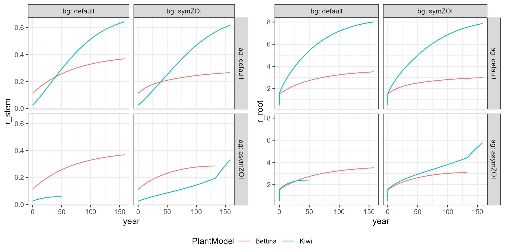

# Mixed vegetation types

This folder contains four project files to test if multiple vegetation types can be used and still interact, i.e., the 
presence of other individuals is recognized in competition concepts.

Note: the combination of Bettina and Kiwi is not sensible

file naming: <belowground_aboveground>  
settings: as in Bettina Default Benchmark  
input: initial population from TreeOutput benchmarks

