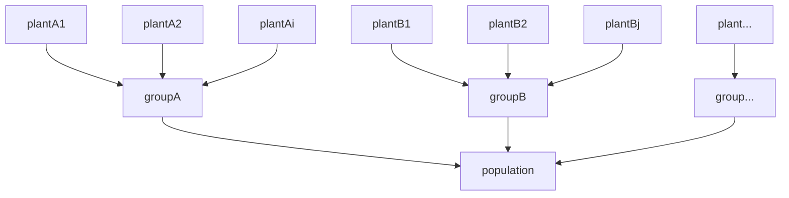

<mark>For developers.</mark>

The population manager contains three objects, managing the code structure of the individual plant, the group and the whole population.

The **Plant** object contains the blueprint of each individual, defined by its position, geometry and network properties (if applicable).
It contains setter and getter methods to define these properties, i.e. to fill the dictionaries and retrieve the corresponding information from any other module.

In the **PlantGroup** object, **Plants** of the same group are collected in a group dictionary.
To add new **Plants** to this dictionary, they have to be recruited (see ``pyMANGA.TimeLoopLib.DynamicTimeStep``).
This includes the production of seeds or seedlings (see ``pyMANGA.PopulationLib.Production``) and their dispersal (see ``pyMANGA.PopulationLib.Dispersal``).
Therefore, the **PlantGroup** object initializes and calls the corresponding libraries.

The **Population** object adds **PlantGroups** to the population dictionary. 
It also contains getter methods to retrieve the **PlantGroups**.
