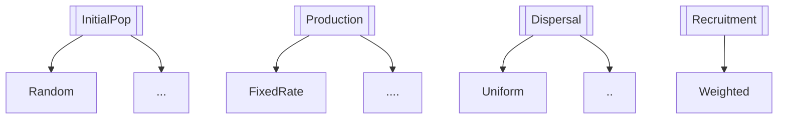

# Description

Library of population modules.

A population consists of one or more groups, which in turn consist of individual plants.
These groups may or may not be of different species.
For each group, separate growth, mortality and establishment modules can be defined.

The establishment process is divided in four parts:
- definition of the initial population (see ``pyMANGA.PopulationLib.InitialPop``)
- seed or seedling production (see ``pyMANGA.PopulationLib.Production``)
- seed or seedling dispersal (see ``pyMANGA.PopulationLib.Dispersal``)
- (optional) seed or seedling recruitment (see ``pyMANGA.PopulationLib.Recruitment``)




# Usage

```xml
<population>
    <group>
        <name> Group_B </name>
        <species> Rhizophora </species>
        <vegetation_model_type> Bettina </vegetation_model_type>
        <mortality>NoGrowth</mortality>
        <domain>
            <x_1> 0 </x_1>
            <y_1> 0 </y_1>
            <x_2> 22 </x_2>
            <y_2> 22 </y_2>
        </domain>
        <initial_population>
            <type>Random</type>
            <n_individuals> 1 </n_individuals>
        </initial_population>
        <production>
            <type>FixedRate</type>
            <per_individual>False</per_individual>
            <per_ha>False</per_ha>
            <n_individuals> 1 </n_individuals>
        </production>
        <dispersal>
            <type> Uniform </type>
        </dispersal>
    </group>
</population>
```

# Attributes

- ``group`` (string): Nesting tag to define a group
- ``name`` (string): Name of the group (can be chosen freely and does not affect the simulation)
- ``species`` (string): see ``pyMANGA.PopulationLib.Species``
- ``vegetation_model_type`` (string): see ``pyMANGA.PlantModelLib``
- ``mortality`` (string): see ``pyMANGA.PlantModelLib.Mortality``
- ``domain`` (nesting-tag): coordinates to define the model domain (as mesh)
    - ``x_1`` (float): x-coordinate of left bottom border of grid
    - ``x_2`` (float): x-coordinate of right bottom border of grid
    - ``y_1`` (float): x-coordinate of left top border of grid
    - ``y_2`` (float): x-coordinate of right top border of grid
- ``initial_population`` (nesting-tag): Defines initial population of a group, see ``pyMANGA.PopulationLib.InitialPop``
- ``production`` (nesting-tag): Defines seed or seedling production of a group, see ``pyMANGA.PopulationLib.Production``
- ``dispersal`` (nesting-tag): Defines seed or seedling dispersal of a group, see ``pyMANGA.PopulationLib.Dispersal``


# Value

An array containing separate dictionaries for each group.

# Author(s)

Marie-Christin Wimmler

# See Also

``pyMANGA.PopulationLib.Species``, ``pyMANGA.PlantModelLib``, ``pyMANGA.PlantModelLib.Mortality``, 
``pyMANGA.PopulationLib.InitialPop``, ``pyMANGA.PopulationLib.Production``, ``pyMANGA.PopulationLib.Dispersal``


# Examples

**2 species example**

Two species (groups), Avicennia and Rhizophora, grow in a model domain of 22x22m.
Tree growth follows the Bettina approach. 
Species parameters and annual mortality are different.
Avicennia starts with 50 trees and 2 new trees are recruited in each time step per existing Acivennia tree, while Rhizophora starts with 20 trees and 8 are recruited in each time step.

```xml
<population>
    <group>
        <name> Group_A </name>
        <species> Avicennia </species>
        <vegetation_model_type> Bettina </vegetation_model_type>
        <mortality>NoGrowth Random</mortality>
        <probability>0.0016</probability>
        <domain>
            <x_1> 0 </x_1>
            <y_1> 0 </y_1>
            <x_2> 22 </x_2>
            <y_2> 22 </y_2>
        </domain>
        <initial_population>
            <type>Random</type>
            <n_individuals> 50 </n_individuals>
        </initial_population>
        <production>
            <type>FixedRate</type>
            <per_individual>True</per_individual>
            <per_ha>False</per_ha>
            <n_individuals> 2 </n_individuals>
        </production>
        <dispersal>
            <type> Uniform </type>
        </dispersal>
    </group>
    <group>
        <name> Group_B </name>
        <species> Rhizophora </species>
        <vegetation_model_type> Bettina </vegetation_model_type>
        <mortality>NoGrowth Random</mortality>
        <probability>0.001</probability>
        <domain>
            <x_1> 0 </x_1>
            <y_1> 0 </y_1>
            <x_2> 22 </x_2>
            <y_2> 22 </y_2>
        </domain>
        <initial_population>
            <type>Random</type>
            <n_individuals> 20 </n_individuals>
        </initial_population>
        <production>
            <type>FixedRate</type>
            <per_individual>True</per_individual>
            <per_ha>False</per_ha>
            <n_individuals> 8 </n_individuals>
        </production>
        <dispersal>
            <type> Uniform </type>
        </dispersal>
    </group>
</population>
```

**Example with recruitment**

Avicennia trees grow in a model domain of 22x10m.
Tree growth follows the ``Bettina`` approach. 
Trees die when maintenance > resource uptake (``NoGrowth``) and randomly with an annual probability of 0.16% (``Random``).
The initial population of 50 trees is randomly generated.
At each time step, 100 seedlings per hectare are produced and uniformly distributed over the model area.
The success of germination, i.e. recruitment, is defined in the ``weights.csv'' file, which has the following form: where xy are the coordinates of each cell in the model and weight is a number between 0 and 1 indicating the probability of germination.

````csv
x,y,weight,idx
0,0,1,1
0.25,0,1,2
````

```xml
<population>
    <group>
        <name> Group_A </name>
        <species> Avicennia </species>
        <vegetation_model_type> Bettina </vegetation_model_type>
        <mortality>NoGrowth Random</mortality>
        <probability>0.0016</probability>
        <domain>
            <x_1> 0 </x_1>
            <y_1> 0 </y_1>
            <x_2> 22 </x_2>
            <y_2> 10 </y_2>
        </domain>
        <initial_population>
            <type>Random</type>
            <n_individuals> 50 </n_individuals>
        </initial_population>
        <production>
            <type>FixedRate</type>
            <per_individual>True</per_individual>
            <per_ha>False</per_ha>
            <n_individuals> 2 </n_individuals>
        </production>
        <dispersal>
            <type> Uniform </type>
        </dispersal>
        <recruitment>
            <type> Weighted </type>
            <weight_file> weights.csv </weight_file>
        </recruitment>
    </group>
</population>
```
